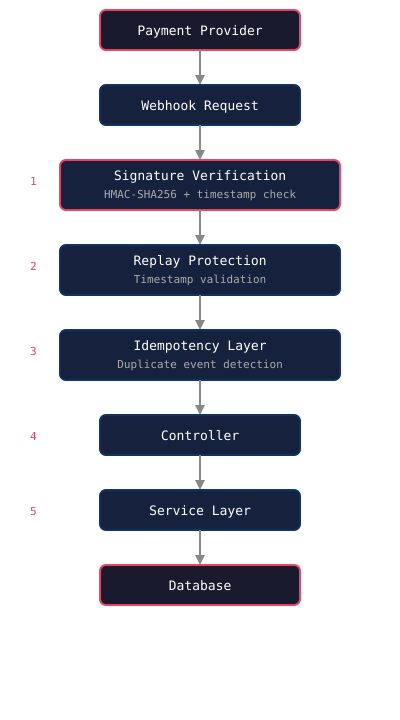

# Secure Payment Webhook Example

[](https://github.com/3278mediadotcom/secure-payment-webhook-example/actions/workflows/test.yml)

A production-style TypeScript webhook processing service demonstrating secure event handling patterns used in payment and SaaS platforms.

## Features

- **HMAC-SHA256 signature verification** — constant-time comparison prevents timing attacks
- **Replay attack protection** — timestamp validation rejects stale requests
- **Idempotent event processing** — duplicate webhook deliveries are safely ignored
- **Request validation with Zod** — malformed payloads rejected before business logic
- **Structured error handling** — consistent `AppError` responses across the API
- **TypeScript-first architecture** — strong typing from types through routes
- **Express middleware pipeline** — clean separation of concerns
- **Graceful server shutdown** — SIGTERM/SIGINT handled cleanly
- **Automated API testing** — Vitest + Supertest covering the full security pipeline

## Architecture



The request flows through a layered middleware pipeline:

1. **Signature Verification** — HMAC-SHA256 + timestamp check rejects forged or replayed requests
2. **Replay Protection** — stale timestamps rejected
3. **Idempotency Layer** — duplicate event IDs safely ignored
4. **Controller** — HTTP request/response handling
5. **Service Layer** — event-type routing and business logic

## Project Structure

```
src/
├── config/          # Environment configuration
├── controllers/     # HTTP request/response handling
├── middleware/      # Signature verification, idempotency, error handler
├── routes/          # Express route definitions
├── services/        # Business logic
├── types/           # TypeScript type definitions
├── utils/           # Crypto, logger, AppError
├── validation/      # Zod schemas
├── app.ts           # Express application setup
└── server.ts        # Server entry point + graceful shutdown
```

## Quick Demo

See the full flow in one command:

```bash
npm run demo
```

This starts the server, generates a signed webhook, sends it, and shows the response:

```
=== Secure Payment Webhook Demo ===

Starting server...
✓ Server started

Sending webhook...

Payload:
{
  "id": "evt_demo_123",
  "type": "payment.completed",
  ...
}

Signature:
a83f9d8c...

Response:
{
  "success": true,
  "eventId": "evt_demo_123",
  "message": "Event processed"
}

✓ Demo complete
```

## Getting Started

### Prerequisites

- Node.js 18+
- npm

### Installation

```bash
npm install
```

### Environment Setup

```bash
cp .env.example .env
```

Then edit `.env` and set a strong `WEBHOOK_SECRET`.

### Run in Development

```bash
npm run dev
```

Server starts at `http://localhost:3000`.

### Run Tests

```bash
npm test
```

### Production Build

```bash
npm run build
npm start
```

## Example Payloads

Ready-to-use webhook payloads are in the [`examples/`](examples/) directory:

| File | Event Type |
|---|---|
| [`payment-completed.json`](examples/payment-completed.json) | `payment.completed` |
| [`payment-refunded.json`](examples/payment-refunded.json) | `payment.refunded` |
| [`payment-failed.json`](examples/payment-failed.json) | `payment.failed` |

## API Reference

### `GET /health`

Health check for load balancers and monitoring.

```json
{
  "status": "ok",
  "service": "secure-payment-webhook-example"
}
```

### `POST /webhook`

Receives and processes webhook events.

**Headers:**

| Header | Description |
|---|---|
| `Content-Type` | `application/json` |
| `X-Webhook-Signature` | HMAC-SHA256 hex signature of the raw body |
| `X-Webhook-Timestamp` | Unix timestamp (optional, replay protection) |

**Request Body:**

```json
{
  "id": "123e4567-e89b-12d3-a456-426614174000",
  "type": "payment.completed",
  "createdAt": "2025-01-01T00:00:00Z",
  "data": {
    "transactionId": "txn_123",
    "amount": 99.99,
    "currency": "USD"
  }
}
```

**Success Response (200):**

```json
{
  "success": true,
  "eventId": "123e4567-e89b-12d3-a456-426614174000",
  "message": "Event processed"
}
```

**Error Responses:**

| Status | Code | Description |
|---|---|---|
| 400 | `INVALID_PAYLOAD` | Zod validation failed |
| 400 | `STALE_WEBHOOK` | Timestamp older than 5 minutes |
| 401 | `MISSING_SIGNATURE` | No signature header |
| 401 | `INVALID_SIGNATURE` | HMAC verification failed |

## Signing Webhooks

Webhook providers sign payloads with HMAC-SHA256 using a shared secret:

```javascript
const { createHmac } = require("crypto");

const signature = createHmac("sha256", process.env.WEBHOOK_SECRET)
  .update(rawBody)
  .digest("hex");
```

Send this in the `X-Webhook-Signature` header.

## Security Notes

- **Never commit `.env`** — only `.env.example` is published
- **Use `timingSafeEqual`** — prevents timing side-channel attacks
- **Validate before verifying** — malformed payloads rejected early
- **Track processed event IDs** — prevents duplicate side effects
- **In production**, replace the in-memory idempotency store with Redis or a database

## CI/CD

GitHub Actions runs on every push and pull request:

- `npm install`
- `npm run build`
- `npm test`

See [`.github/workflows/test.yml`](.github/workflows/test.yml).

## Tech Stack

- **TypeScript** — type safety end-to-end
- **Express** — HTTP framework
- **Zod** — runtime validation
- **Vitest + Supertest** — testing
- **tsx** — TypeScript execution

## License

ISC